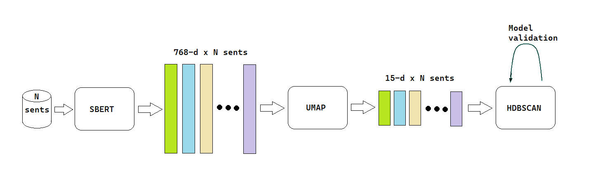
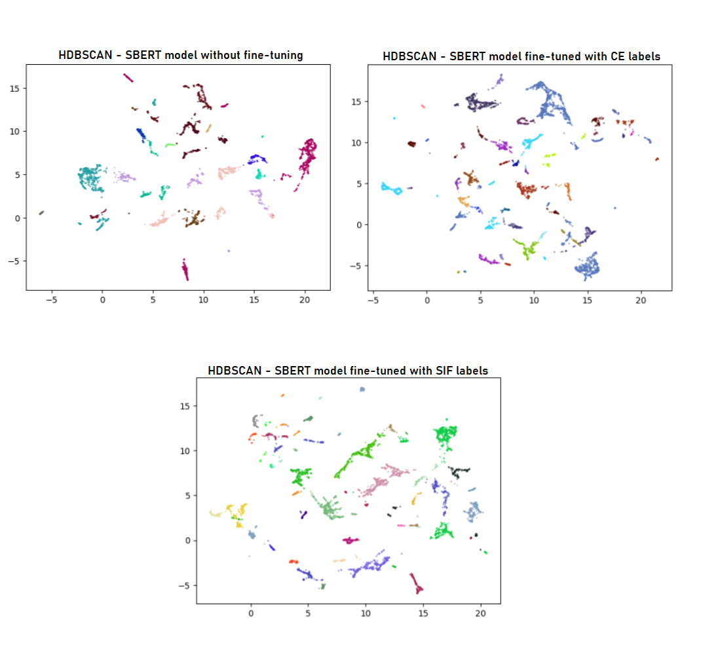

## Self-Supervised Fine-Tuning of Sentence Embedding Models using a Smooth Inverse Frequency Model

### Overview

This README provides an overview of a Master's thesis in Data Science and Engineering, and Machine Learning.
It focuses on self-supervised fine-tuning of sentence embedding models. The thesis explores the effectiveness of the self-supervised approach to various downstream tasks in Natural Language Processing (NLP) and evaluates the results against baseline models.

### Key Contributions

1. **Collaboration with Gavagai**: The project was conducted in collaboration with the Swedish company Gavagai, aiming to extract valuable insights from their large collection of unlabeled textual data, reducing the need for manual labeling.

2. **Fine-Tuning and Evaluation**: The thesis fine-tunes the Sentence-BERT model with automatically produced labels and evaluates the quality of the fine-tuned model against baseline models in three downstream tasks: sentence paraphrasing, sentence similarity, and sentence clustering.

3. **Automatic Target Set Construction**: The automatic target set construction technique is a key aspect of this research. It involves two steps: sentence pair extraction and sentence pair labeling. The SIF model is used for this purpose, and two labeling scenarios are explored.

4. **Hyperparameter Tuning**: Standard hyperparameters are used for fine-tuning sentence-BERT, allowing for a fair comparison among different fine-tuning scenarios. Hyperparameter tuning for the HDBSCAN clustering algorithm is also performed.

5. **Qualitative Assessment**: A survey is conducted to qualitatively assess clustering results, comparing the fine-tuned model with the baseline.

6. **Future Research Directions**: The thesis discusses potential improvements for future research, including robust model evaluation with K-fold cross-validation and enhanced qualitative evaluation for clustering tasks using GPT models.

### Key Figures and Results

1. **Figure 1**: Pipeline for the clustering task, including UMAP dimensionality reduction and HDBSCAN clustering.
2. **Figure 2**: Comparison of clustering outcomes with different sentence embedding models.

### Thesis Findings

- **Sentence Paraphrasing Task**: Self-supervised techniques outperformed the baseline after only one epoch, with the Contrastive Loss showing better results than the Multiple Negative Ranking Loss. The CrossEncoder labels achieved the best F1 score, surpassing the baseline.

- **Sentence Similarity Task**: All distinct training scenarios demonstrated superior performance compared to the baseline, with real labels still outperforming automatic labels in terms of the Pearson score.

- **Clustering Task**: While the self-supervised fine-tuned models showed promise in improving clustering results, qualitative assessments did not conclusively surpass the baseline.

### Future Research Directions

- Implement K-fold cross-validation for more robust model evaluation.
- Enhance qualitative clustering evaluation, possibly using GPT models.
- Continue exploring self-supervised techniques for other NLP tasks and datasets.

### Conclusion

This Master's thesis showcases the effectiveness of self-supervised fine-tuning techniques for sentence embedding models in various NLP tasks. While quantitative improvements were observed, further research is needed to address qualitative evaluations and explore additional applications.

For more details, refer to the full thesis document.
